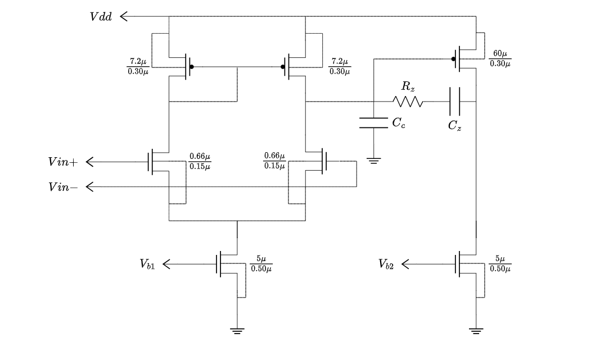
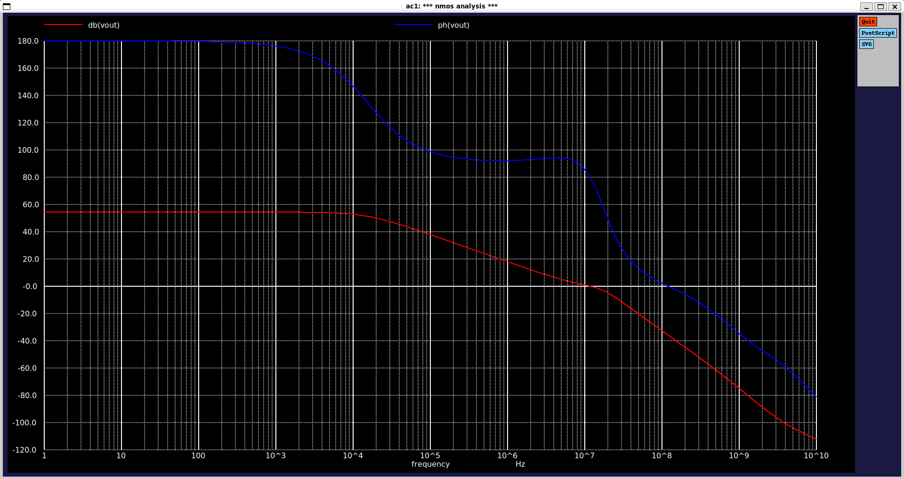

# Miller-Compensated Two-Stage Amplifier

Ngspice simulations of a MOS common-source stage, a differential-pair OTA, and a two-stage amplifier with Miller compensation. The circuits use the SKY130A 1.8 V transistor models.

## Repository layout

| Path | Description |
| --- | --- |
| `CS_stage/cs_stage.spice` | Common-source stage with a PMOS active load and NMOS current-source load. Reports the PMOS drain current, transconductance, and output conductance. |
| `OTA/ota.spice` | Differential-pair OTA with a PMOS current-mirror load, a 2 pF compensation capacitor, and an NMOS current-source load. Estimates output resistance from the device conductances. |
| `Two_Stage/main.spice` | Complete two-stage amplifier. The OTA drives a common-source second stage with a feed-forward zero network and capacitive loading. Measures gain-bandwidth and phase margin. |
| `Two_Stage/Result/Result.png` | Saved AC Bode plot of the two-stage amplifier. |
| `Two_Stage/Result/Two_stage_ota.png` | Circuit diagram of the two-stage amplifier. |

## Requirements

- [Ngspice](https://ngspice.sourceforge.io/)
- The SKY130A PDK with the `sky130.lib.spice` model library
- `PDK_ROOT` set to the directory containing the PDK

The netlists load the typical-corner model with:

```spice
.lib "$PDK_ROOT/sky130A/libs.tech/ngspice/sky130.lib.spice" tt
```

For example, set the PDK path before running a simulation:

```bash
export PDK_ROOT=/path/to/pdk
```

## Running the simulations

Run a deck interactively from its directory:

```bash
cd ./CS_stage
ngspice cs_stage.spice

cd ./OTA
ngspice ota.spice

cd ./Two_Stage
ngspice main.spice
```

For a non-interactive run, write the console output to a file:

```bash
ngspice -b -o Two_Stage/Result/main.log Two_Stage/main.spice
```

The two-stage deck opens an AC plot when run interactively. Its control block sweeps from 1 Hz to 10 GHz and prints:

- `gbw_freq`: first frequency where the output magnitude crosses 0 dB
- `phase_at_gbw`: output phase at that crossing
- `pm`: the reported phase value at the gain-bandwidth frequency

## Circuit notes

The complete amplifier is assembled from two subcircuits:

1. `OTA`: a PMOS current-mirror-loaded differential pair with a 2 pF compensation capacitor.
2. `CSstage`: a PMOS common-source stage with a 9 kOhm and 2 pF feed-through network, plus a 5 pF output load.

The supply is 1.8 V. The OTA inputs are biased at 1 V with equal and opposite small-signal AC amplitudes (`+0.5` and `-0.5`), and the nominal tail/load current is 75 uA.

## Circuit


The amplifier operates from a 1.8 V supply (`VDD`) with an input common-mode voltage (`VICM`) of 1 V. The bias voltages `Vb1` and `Vb2` are generated by current mirrors set to 20 uA and 75 uA, respectively.

## Results



The plot shows the simulated output magnitude in dB and phase in degrees. Re-run the deck after changing device sizes, compensation values, loads, or bias conditions to regenerate the measurements.
